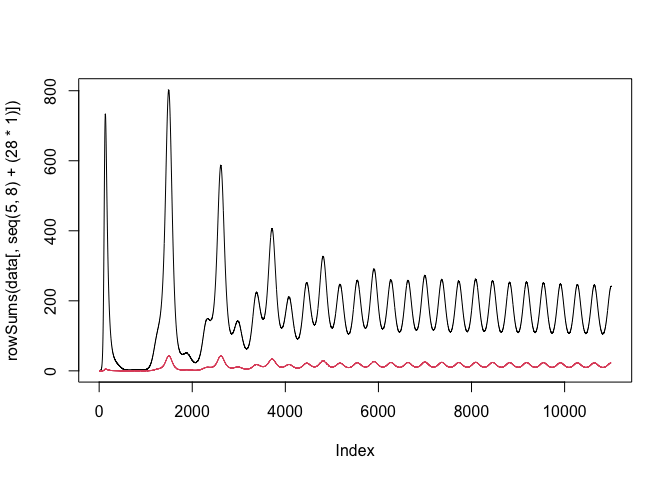

<!-- README.md is generated from README.Rmd. Please edit that file -->

# noromod

<!-- badges: start -->

[](https://github.com/pratikunterwegs/noromod/actions/workflows/R-CMD-check.yaml)
<!-- badges: end -->

The goal of noromod is to provide a three implementations of a model of
age-stratified norovirus transmission.

## Installation

You can install the development version of noromod from
[GitHub](https://github.com/) with:

``` r
# install.packages("devtools")
pak::pak("pratikunterwegs/noromod")
```

## Compartment structure in initial conditions

``` r
# S|E|Ia|Is|R|V1|Ev1|Iav1|Isv1|Rv1|V2|Ev2|Iav2|Isv2|Rv2|Ni|Ri|Niv1|Riv1|Niv2|Riv2|
```

## Example

This is a basic example which shows you how to use the three
implementations.

Prepare parameters.

``` r
library(noromod)
library(deSolve)
```

``` r
# define parameters
# initial conditions
init <- c(
  3857263, 8103718, 42460865, 12374961, # S
  100, 0, 0, 0, # E
  100, 0, 0, 0, # Is
  99, 0, 0, 0, # Ia
  0, 0, 0, 0, # R
  0, 0, 0, 0, # new infections
  0, 0, 0, 0 # reinfections
)
init_vax1 <- matrix(0, nrow = 4, ncol = 7)
init_vax2 <- init_vax1
init_mat <- matrix(
  init,
  nrow = 4, ncol = 7
)

init_mat <- cbind(init_mat, init_vax1, init_vax2)

age_groups <- c(0, 5, 15, 65)
polymod <- socialmixr::polymod
UK_structure <- socialmixr::contact_matrix(
  polymod,
  countries = "United Kingdom",
  age.limits = c(age_groups),
  symmetric = TRUE
)
#> Removing participants that have contacts without age information. To change this behaviour, set the 'missing.contact.age' option
```

``` r

# Symmetrical contact matrix
uk_contact_rate_matrix <- as.matrix(UK_structure$matrix)
demography <- UK_structure$demography$population

uk_contact_rate_matrix <- t(t(uk_contact_rate_matrix) / demography)

# add contact matrix to pop
params <- default_parameters()
params[["contacts"]] <- uk_contact_rate_matrix
params[["season_offset"]] <- rep(0.5, length(params[["season_offset"]]))

# time points
times <- seq(0, 11000)
```

### Using the R-only model with deSolve

``` r
data <- as.data.frame(
  deSolve::lsoda(init_mat, times, norovirus_model_r, params)
)

plot(rowSums(data[, seq(6, 9) + 28]), type = "l")
lines(rowSums(data[, seq(6, 9) + (28 * 2)]), type = "l", col = 2)
```


### Using Boost solvers

``` r
# Using Boost solvers for increased speed
# run model
data <- noromod_cpp_boost(
  initial_conditions = init_mat,
  params = params, time_end = 11000, increment = 1
)

data <- do.call(rbind, lapply(data[["x"]], as.vector))

# plot vaccination strata exposed (adding unvaccinated distorts plot scale)
plot(rowSums(data[, seq(5, 8) + (28 * 1)]), type = "l")
lines(rowSums(data[, seq(5, 8) + (28 * 2)]), type = "l", col = 2)
```



### Speed comparison

``` r
times <- seq(11000)
microbenchmark::microbenchmark(
  "noromod_r" = deSolve::lsoda(init_mat, times, norovirus_model_r, params),
  "noromod_cpp_boost" = noromod_cpp_boost(
    initial_conditions = init_mat,
    params = params, time_end = max(times), increment = 1
  ),
  times = 10
)
#> Warning in microbenchmark::microbenchmark(noromod_r = deSolve::lsoda(init_mat,
#> : less accurate nanosecond times to avoid potential integer overflows
#> Unit: milliseconds
#>               expr        min         lq       mean    median        uq
#>          noromod_r 2549.44732 2949.63459 2965.69362 2995.5206 3119.3767
#>  noromod_cpp_boost   77.36958   82.89552   99.53861  101.5221  110.9312
#>        max neval
#>  3184.7217    10
#>   123.9466    10
```
