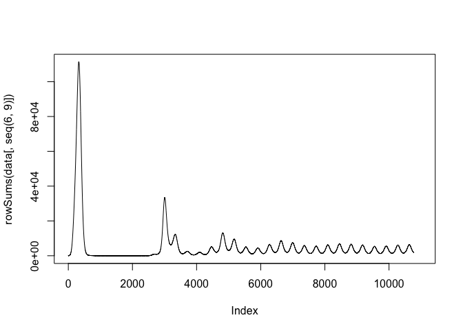
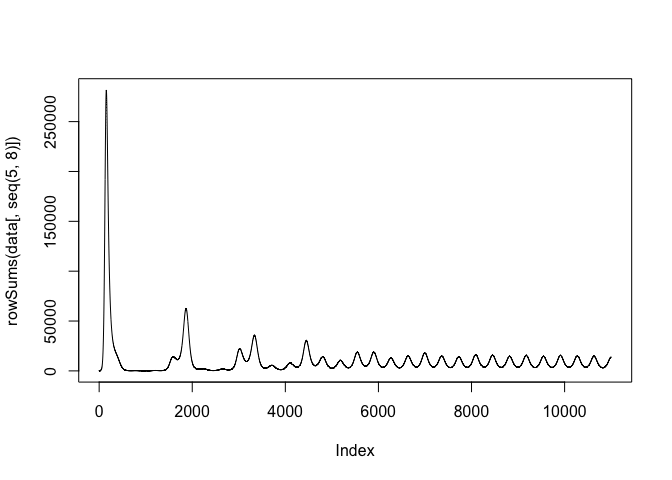

<!-- README.md is generated from README.Rmd. Please edit that file -->

# noromod

The *noromod* package implements a model of age-stratified norovirus
transmission.

## Installation

You can install the development version of noromod from
[GitHub](https://github.com/) with:

``` r
# install.packages("devtools")
pak::pak("pratikunterwegs/noromod")
```

## Example

This is a basic example which shows you how to use the three
implementations.

Prepare parameters.

``` r
library(noromod)
library(deSolve)
```

``` r
# define parameters
# initial conditions
init <- c(
  3857263, 8103718, 42460865, 12374961,
  100, 0, 0, 0,
  0, 0, 0, 0,
  0, 0, 0, 0,
  0, 0, 0, 0,
  0, 0, 0, 0,
  0, 0, 0, 0
)
init_mat <- matrix(
  init,
  nrow = 4, ncol = 7
)

age_groups <- c(0, 5, 15, 65)
polymod <- socialmixr::polymod
UK_structure <- socialmixr::contact_matrix(
  polymod,
  countries = "United Kingdom",
  age.limits = c(age_groups),
  symmetric = TRUE
)
#> Removing participants that have contacts without age information. To change this behaviour, set the 'missing.contact.age' option

# Symmetrical contact matrix
uk_contact_rate_matrix <- as.matrix(UK_structure$matrix)
demography <- UK_structure$demography$population

uk_contact_rate_matrix <- t(t(uk_contact_rate_matrix) / demography)

# add contact matrix to pop
params <- default_parameters()
params[["contacts"]] <- uk_contact_rate_matrix

# time points
times <- seq(0, 11000)
```

### Using the R-only model with deSolve

``` r
data <- as.data.frame(deSolve::lsoda(init, times, norovirus_model_r, params))

plot(rowSums(data[, seq(6, 9)]), type = "l")
```



### Using Boost solvers

``` r
# Using Boost solvers for increased speed
# run model
data <- noromod_cpp_boost(
  initial_conditions = init_mat,
  params = params, time_end = 11000, increment = 1
)

data <- do.call(rbind, lapply(data[["x"]], as.vector))

plot(rowSums(data[, seq(5, 8)]), type = "l")
```



### Speed comparison

``` r
microbenchmark::microbenchmark(
  "noromod_r" = deSolve::lsoda(init, times, norovirus_model_r, params),
  "noromod_cpp" = deSolve::lsoda(init, times, norovirus_model_cpp, params),
  "noromod_cpp_boost" = noromod_cpp_boost(
    initial_conditions = init_mat,
    params = params, time_end = max(times), increment = 1
  )
)
#> Warning in microbenchmark::microbenchmark(noromod_r = deSolve::lsoda(init, :
#> less accurate nanosecond times to avoid potential integer overflows
#> Unit: milliseconds
#>               expr       min        lq      mean    median        uq       max
#>          noromod_r 518.46415 529.22148 575.55364 545.39059 624.63110 738.86084
#>        noromod_cpp 149.41704 154.76899 168.73388 159.16751 170.50311 283.83578
#>  noromod_cpp_boost  27.00166  27.32644  29.63176  27.67916  29.87814  56.33958
#>  neval
#>    100
#>    100
#>    100
```
