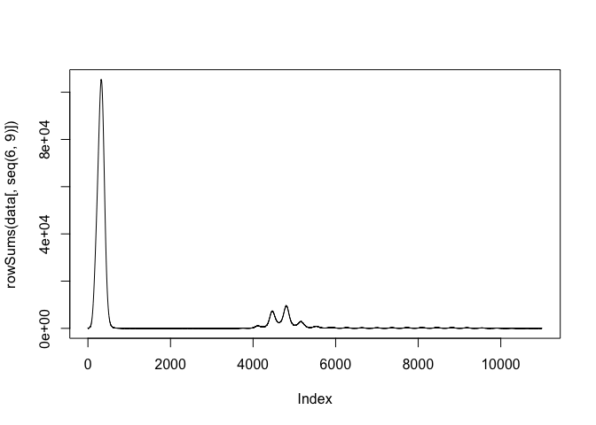

<!-- README.md is generated from README.Rmd. Please edit that file -->

# noromod

<!-- badges: start -->

[](https://github.com/pratikunterwegs/noromod/actions/workflows/R-CMD-check.yaml)
<!-- badges: end -->

The goal of noromod is to provide a three implementations of a model of
age-stratified norovirus transmission.

## Installation

You can install the development version of noromod from
[GitHub](https://github.com/) with:

``` r
# install.packages("devtools")
pak::pak("pratikunterwegs/noromod")
```

## Example

This is a basic example which shows you how to use the three
implementations.

Prepare parameters.

``` r
library(noromod)
library(deSolve)

# define parameters
# initial conditions
init <- c(
  3857263, 8103718, 42460865, 12374961,
  100, 0, 0, 0,
  0, 0, 0, 0,
  0, 0, 0, 0,
  0, 0, 0, 0,
  0, 0, 0, 0,
  0, 0, 0, 0
)
init_mat <- matrix(
  init,
  nrow = 4, ncol = 7
)

age_groups <- c(0, 5, 15, 65)
polymod <- socialmixr::polymod
UK_structure <- socialmixr::contact_matrix(
  polymod,
  countries = "United Kingdom",
  age.limits = c(age_groups),
  symmetric = TRUE
)
#> Using POLYMOD social contact data. To cite this in a publication, use the 'get_citation()' function
#> Removing participants that have contacts without age information. To change this behaviour, set the 'missing.contact.age' option

# Symmetrical contact matrix
uk_contact_rate_matrix <- as.matrix(UK_structure$matrix)
demography <- UK_structure$demography$population

uk_contact_rate_matrix <- t(t(uk_contact_rate_matrix) / demography)

# add contact matrix to pop
params <- list(
  sigma = 0.714148,
  rho = 0.06866991,
  season_amp = 7.446415,
  season_offset = 0.07817456,
  D_immun = 6.780921,
  probT_under5 = 1.828666,
  probT_over5 = 3.669896,
  b = (11.4 / 1000) / 365,
  d = (11.4 / 1000) / 365,
  epsilon = 1,
  psi = 1 / 2,
  gamma = 1 / 10,
  n_age_groups = 4
)
params[["contacts"]] <- uk_contact_rate_matrix

params$aging <- matrix(
  c(
    c(-0.25, 0.25, 0, 0),
    c(0, -0.1, 0.1, 0),
    c(0, 0, -0.02, 0.02),
    c(0, 0, 0, 0)
  ),
  nrow = 4, ncol = 4
) / 365


# time points
times <- seq(11000)
```

### Using the Rcpp model with deSolve

``` r
data <- as.data.frame(deSolve::lsoda(init, times, norovirus_model_r, params))

plot(rowSums(data[, seq(6, 9)]), type = "l")
```



### Using Boost solvers

``` r
# Using Boost solvers for increased speed
# initial conditions are a matrix
init_matrix <- matrix(init, nrow = 4, ncol = 7)

init_matrix
#>          [,1] [,2] [,3] [,4] [,5] [,6] [,7]
#> [1,]  3857263  100    0    0    0    0    0
#> [2,]  8103718    0    0    0    0    0    0
#> [3,] 42460865    0    0    0    0    0    0
#> [4,] 12374961    0    0    0    0    0    0

# run model
data <- noromod_cpp_boost(
  initial_conditions = init_matrix,
  params = params, time_end = 11000, increment = 1
)

data <- output_to_df(data)

plot(rowSums(data[, seq(5, 8)]), type = "l")
```


### Speed comparison

``` r
microbenchmark::microbenchmark(
  "noromod_r" = deSolve::lsoda(init, times, norovirus_model_r, params),
  "noromod_cpp" = deSolve::lsoda(init, times, norovirus_model_cpp, params),
  "noromod_cpp_boost" = noromod_cpp_boost(
    initial_conditions = init_mat,
    params = params, time_end = max(times), increment = 1
  )
)
#> Unit: milliseconds
#>               expr        min         lq      mean     median        uq
#>          noromod_r 1251.87856 1522.67995 1757.0451 1746.22120 1920.9282
#>        noromod_cpp  366.37315  446.62543  530.8326  511.36923  579.0844
#>  noromod_cpp_boost   78.61849   85.67864  100.1993   95.19094  113.0682
#>        max neval
#>  2827.1653   100
#>   993.7156   100
#>   173.7234   100
```
